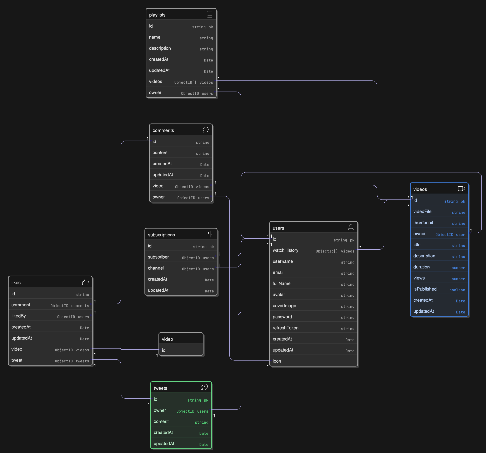

# videoTube

## Initialise project

1. `npm init`
2. Set variables as prompted
3. Set type to es6 in package.json, install dev dependencies nodemon and prettier
4. Create prettierrc and prettierignore files
5. Create subfolders and files under src/
6. Create model files
7. Install express and mongoose
8. Create a start script and dev script in `package.json` using nodemon & run `npm run dev/start`

## Creation of database connection

1. It can always fail - use try-catch
2. It is always in a different continent - use async-await

## Asynchronous handler

- Async requests may fail. Instead of repeatedly using try/catch, use higher order function
- Put in utils

## ApiResponse and ApiError objects

- Exist to standardize responses

Unprofessional way to write an endpoint:

1. Go to src/appdex.js
2. Write `app.get("healthcheck", () => {...})`

Better way: create a healthcheck controller at `healthcheck.controllers.js`. Check file there. Route to the controller from `healthcheck.routes.js` and route to that router from app.js with `app.use("path/prefix", controllerRouter)`. We do app.use not get() because we want this to be used for all HTTP methods.

1. Controller
2. Routes
3. App

## Database modelling

ERD we want to model:

## Mongoose middleware

- Can specify prehooks and posthooks

  - prehooks is before you save to DB
  - posthooks is after save to DB

- Methods

  - Can add methods to the schema that can be called with `schema.method()`
  - Compare if a new password is the same as the existing one: https://www.npmjs.com/package/bcrypt

- Refresh tokens: JWTs. https://jwt.io
  - JWT library: https://www.npmjs.com/package/jsonwebtoken
  - JWT is used to authenticate the user. We can put any data in it that we like. It will expire after a fixed duration, which we can control. We also need to sign it with a secret that we own, so that when the user sends it back to us, we are sure that we created it and not someone else.

## File handling

- Handle cookies using `cookie-parser` library
- Handle files with `multer` library
- Create multer middleware that saves uploaded files to disk: https://www.npmjs.com/package/multer#multeropts
- Create a utility function that uploads images to cloudinary and deletes the local file
